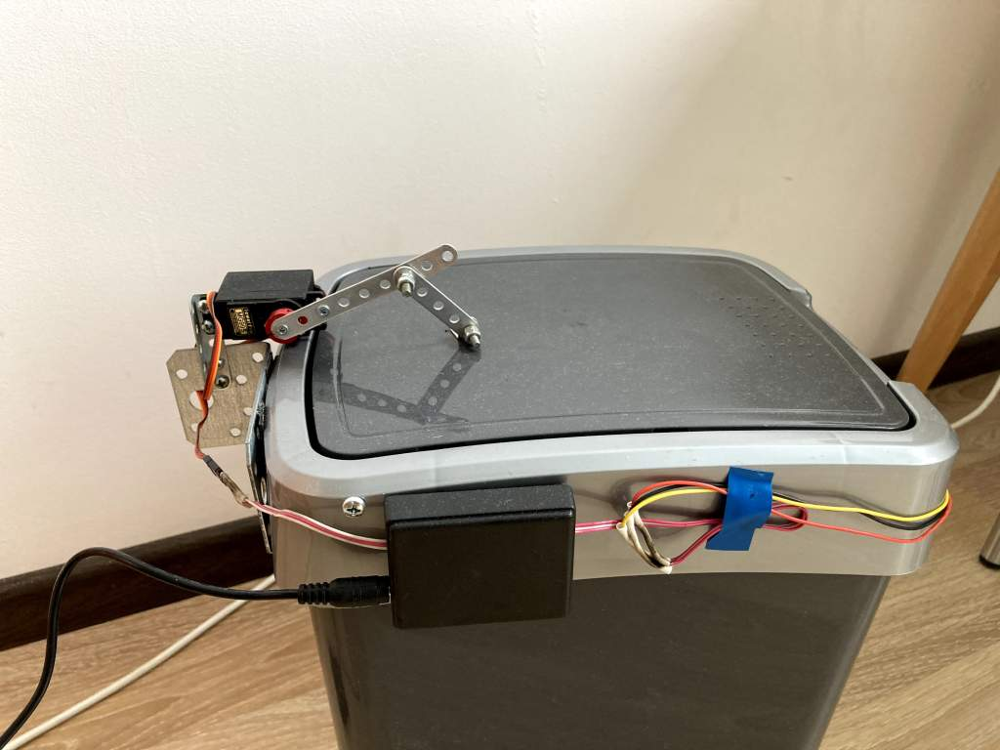
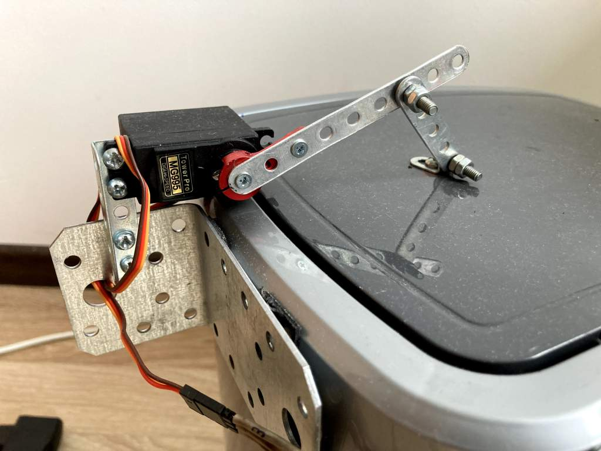

# Automatic trash bin 

Trash bin that automatically opens when you approach your hand to it.

Cirquit:
. 
Check pinout of the sensor, regulator and server you have prior to assemby - pin numbers on the 
cirquit may not match (I didn't find a way in Fritzing to specify pin numbers).

Also [available in Fritzing format](auto_trash_bin.fzz?raw=true).

